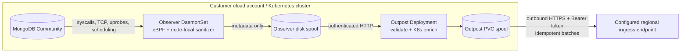

# MongoDB DAM

Standalone customer-cluster components for a MongoDB Database Activity Monitoring product. This repository deploys MongoDB Community, one eBPF Observer per Linux node, and a durable Outpost that sends sanitized metadata to a configured regional endpoint over HTTPS with bearer authentication. The destination is intentionally opaque to this repository and is not assumed to be Collect.

It has no dependency on the Foundry infrastructure repository and contains no GitHub Actions. Building, pushing, and deployment are initiated locally.



## What is implemented

- MongoDB `OP_MSG`, legacy `OP_QUERY`/`OP_REPLY`, and `OP_COMPRESSED` decoding with bounded buffers, fragmentation handling, command/database/collection extraction, response status, and request/response duration correlation.
- Plaintext socket interception at read/write syscalls and `SSL_read`/`SSL_write` uprobes for compatible OpenSSL/BoringSSL-backed `mongod`/`mongos` processes.
- TCP connect/accept/close, handshake-established events (with duration when the start is observable), peer/active resets, zero-window signals, sampled smoothed RTT, retransmissions, and state-derived timeout signals.
- Plaintext UDP DNS query/response metadata for MongoDB processes, including name, record type, response code, answer count, and correlated duration.
- `pread`, `pwrite`, `fsync`, `fdatasync`, `openat`, slow page-fault, scheduler off-CPU, on-CPU stack, and `pthread_mutex_lock` wait telemetry.
- MongoDB process exec/exit tracking, socket endpoint lookup, pod UID extraction from cgroups, and Outpost enrichment from the Kubernetes API.
- A versioned metadata-only event contract, node-local and Outpost durable spools, assignment validation, internal authentication, regional token authentication, custom CA support, idempotency keys, health endpoints, and Prometheus metrics.
- A generic mock endpoint for integration testing.

The chart pins the official Community image to `mongo:8.0.29-noble`. Override it through `mongodb.image` when your patch-management process approves a newer Community release.

## Privacy boundary

The eBPF program copies at most 1 KiB from a MongoDB I/O operation into a node-local ring buffer so the Observer can identify BSON metadata. Userspace caps each large-frame prefix at 1 KiB even when it arrives through many short syscalls. Those transient bytes are never logged, serialized, spooled, or sent to Outpost. Only the fields defined in `dam-schema` can cross the node boundary; no attempt is made to retain or export the omitted body.

Authentication principals are never emitted in clear text. Observer extracts a username from an explicit BSON `user` field or the SCRAM client-first payload when present, immediately hashes it with the customer-provided salt, and discards the clear value. Passwords, proofs, nonces, and complete authentication payloads are never serialized or exported.

## Prerequisites

- Linux Kubernetes nodes with kernel 5.8 or newer, BTF at `/sys/kernel/btf/vmlinux`, tracefs, and a runtime that permits privileged pods and host PID access.
- For the pinned MongoDB 8 image, avoid Linux kernels 6.19 through 7.0.13. [MongoDB documents that it refuses to start on that range](https://www.mongodb.com/docs/manual/release-notes/8.0/#mongodb-is-incompatible-with-linux-kernel-6.19-through-7.0.13); the deployment preflight detects affected nodes.
- `docker`, `kubectl`, Helm 3/4, and access to a container registry reachable from the customer account.
- A dedicated namespace that may carry the `pod-security.kubernetes.io/enforce=privileged` label.
- Outbound DNS and HTTPS from Outpost to the regional cell. There is no inbound cross-account connection.
- A regional HTTP-push endpoint matching [the contract](docs/HTTP_PUSH_CONTRACT.md). Until the regional receiver is built, Outpost retains batches on its PVC or can target the bundled mock endpoint.

Managed environments that prohibit privileged DaemonSets—such as many serverless Kubernetes node offerings—cannot host Observer. Atlas database nodes are also out of scope because customers cannot attach probes to them.

## Build and push locally

```bash
REGISTRY=111122223333.dkr.ecr.ap-south-1.amazonaws.com \
TAG=v0.1.0 \
PUSH_IMAGES=true \
./scripts/build-images.sh
```

Authenticate Docker to the registry first. For a local cluster, omit `REGISTRY` and `PUSH_IMAGES`, then load the resulting images using the mechanism provided by kind, minikube, or your local runtime.
Set `BUILD_MOCK=true` only when you also want the disposable endpoint test image; it is not built or pushed for a normal customer deployment.

Run the full Rust/eBPF build-time suite and the disposable Outpost contract test locally with:

```bash
make test-container
make test-http-push
```

On a Linux Docker host that permits privileged containers, run the live probe-to-MongoDB test with `make test-ebpf`. Override `MONGODB_TEST_IMAGE` when the host kernel is incompatible with the chart's pinned MongoDB 8 image.

## Deploy to the other cloud account

The deployment script refuses to continue unless the active kubecontext exactly matches `EXPECTED_KUBE_CONTEXT`. This is the guardrail against accidentally deploying to the Foundry/current account.

Generate a local ignored secret file once:

```bash
./scripts/generate-secrets.sh
set -a
source deploy/examples/secrets.local.env
set +a
```

Replace the generated `BEARER_TOKEN` with the token provisioned for this source at the regional endpoint, or provision the generated value there. Then deploy:

```bash
export EXPECTED_KUBE_CONTEXT=customer-production
export CUSTOMER_ID=customer-acme
export TENANT_ID=tenant-acme
export SOURCE_ID=mongodb-prod-ap-south-1
export REGIONAL_CELL_ID=cell-ap-south-1
export CLUSTER_NAME=acme-production-eks
export ENDPOINT=https://ingress.cell-ap-south-1.example.com/v1/ingest/mongodb-dam
export OBSERVER_IMAGE_REPOSITORY=111122223333.dkr.ecr.ap-south-1.amazonaws.com/mongodb-dam-observer
export OUTPOST_IMAGE_REPOSITORY=111122223333.dkr.ecr.ap-south-1.amazonaws.com/mongodb-dam-outpost
export TAG=v0.1.0
export VALUES_FILE=deploy/examples/customer-values.yaml
# Set this when overriding mongodb.image.tag so preflight checks that version.
export MONGODB_IMAGE_TAG=8.0.29-noble

./scripts/deploy.sh
./scripts/smoke-test.sh
```

Set `ENDPOINT_CA_FILE=/path/to/ca.pem` when the endpoint uses a private CA. Secrets are staged in a mode-0700 temporary directory, applied as a Kubernetes Secret, and removed when the script exits.

## Repository map

- `bpf/`: CO-RE eBPF programs and the minimal build-time kernel type header.
- `crates/observer/`: probe loader, bounded sanitizer, correlation, enrichment, batching, and node spool.
- `crates/outpost/`: authenticated intake, Kubernetes enrichment, PVC spool, and HTTPS exporter.
- `crates/mongo-protocol/`: safe MongoDB wire/BSON metadata decoder.
- `crates/schema/`: the only serializable data model allowed out of the customer node.
- `crates/mock-endpoint/`: local stand-in for the configured regional endpoint.
- `deploy/helm/mongodb-dam/`: single Helm chart for the customer cluster.
- `scripts/`: local build, preflight, deployment, and smoke-test entry points.

## Important limits

This implementation reports application request/response duration, available TCP handshake duration, and the kernel's smoothed RTT as separate measurements. A single server-side sensor cannot mathematically split one request delta into exact database execution time and exact network transit time. The lifecycle probes distinguish peer resets, active resets, zero-window signals, retransmissions, and state-derived timeouts; exact packet timestamps and kernel-version-specific reset enums require a separate TC/XDP packet sensor.

TLS visibility depends on compatible, visible `SSL_*` symbols. Observer checks mapped OpenSSL/BoringSSL libraries and exported symbols in a statically linked executable, but inlined/stripped implementations, incompatible custom BIO paths, and kTLS have no generic user-space plaintext boundary to attach to. Compressed MongoDB frames can only be decoded when the complete compressed frame is present in the bounded stream. Plaintext DNS over UDP is decoded; DNS over TCP, DoT, DoH, and batched `sendmmsg`/`recvmmsg` resolver traffic are explicit boundaries.

The profiler emits raw instruction addresses for later symbolization; regional flamegraph aggregation and symbol management belong in the next product phase. The stated overhead must be benchmarked against the customer's kernel, traffic, and profiling settings—it is not safe to promise a universal percentage.

See [known gaps](docs/KNOWN_GAPS.md) and [operations](docs/OPERATIONS.md) before production use.
