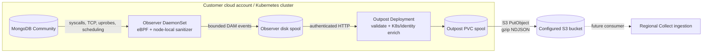

# MongoDB DAM

Standalone customer-cluster components for a MongoDB Database Activity Monitoring product. This repository deploys MongoDB Community, one eBPF Observer per Linux node, and a durable Outpost that uploads bounded DAM events to a configured S3 bucket as gzip-compressed NDJSON. A bearer-authenticated HTTP destination remains available for the bundled local receiver and compatibility tests.

It has no dependency on the Foundry infrastructure repository and contains no GitHub Actions. Building, pushing, and deployment are initiated locally.



## What is implemented

- MongoDB `OP_MSG`, legacy `OP_QUERY`/`OP_REPLY`, and `OP_COMPRESSED` decoding with bounded buffers, fragmentation handling, command/database/collection extraction, response status, and request/response duration correlation.
- Per-connection SCRAM principal attribution plus delete-one/delete-many scope and affected-document metadata for downstream rule evaluation.
- Plaintext socket interception at read/write syscalls and `SSL_read`/`SSL_write` uprobes for compatible OpenSSL/BoringSSL-backed `mongod`/`mongos` processes.
- TCP connect/accept/close, handshake-established events (with duration when the start is observable), peer/active resets, zero-window signals, sampled smoothed RTT, retransmissions, and state-derived timeout signals.
- Plaintext UDP DNS query/response metadata for MongoDB processes, including name, record type, response code, answer count, and correlated duration.
- `pread`, `pwrite`, `fsync`, `fdatasync`, `openat`, slow page-fault, scheduler off-CPU, on-CPU stack, and `pthread_mutex_lock` wait telemetry.
- MongoDB process exec/exit tracking, socket endpoint lookup, pod UID extraction from cgroups, and Outpost enrichment from the Kubernetes API.
- A versioned event contract with metadata-only defaults and opt-in MongoDB query content for demoware, node-local and Outpost durable spools, assignment validation, internal authentication, deterministic S3 object keys, gzip NDJSON encoding, health endpoints, and Prometheus metrics.
- Optional demo-only Outpost enrichment that maps a salted MongoDB principal to an AWS IAM principal and the exact Secrets Manager credential ARN before export.
- An optional bearer-authenticated HTTPS exporter retained for the bundled receiver and legacy integration tests.
- A generic mock endpoint for integration testing.

The chart pins the official Community image to `mongo:8.0.29-noble`. Override it through `mongodb.image` when your patch-management process approves a newer Community release.

## Privacy boundary

The eBPF program copies at most 1 KiB from a MongoDB I/O operation into a node-local ring buffer. Userspace caps each large-frame prefix at 1 KiB even when it arrives through many short syscalls. By default those transient bytes are used only to derive metadata and are never serialized. When `OBSERVER_CAPTURE_QUERY_CONTENT=true`, Observer additionally exports the decoded command document in `details.query` for `find`, `aggregate`, `insert`, `update`, and `delete`, but only when the complete BSON command fits within that bounded capture. Larger or incomplete commands retain their normal metadata and omit `details.query`; Observer never exports partial query JSON.

MongoDB authentication principals are never emitted in clear text. Observer extracts a username from an explicit BSON `user` field or the SCRAM client-first payload when present, immediately hashes it with the customer-provided salt, and discards the clear value. In the opt-in IAM demo, Outpost can join that salted hash to a protected customer mapping and export the corresponding IAM ARN, AWS account ID, and Secrets Manager secret ARN as actor metadata. Passwords, AWS credentials, proofs, nonces, and complete authentication payloads are never serialized or exported.

## Prerequisites

- Linux Kubernetes nodes with kernel 5.8 or newer, BTF at `/sys/kernel/btf/vmlinux`, tracefs, and a runtime that permits privileged pods and host PID access.
- For the pinned MongoDB 8 image, avoid Linux kernels 6.19 through 7.0.13. [MongoDB documents that it refuses to start on that range](https://www.mongodb.com/docs/manual/release-notes/8.0/#mongodb-is-incompatible-with-linux-kernel-6.19-through-7.0.13); the deployment preflight detects affected nodes.
- `docker`, `kubectl`, Helm 3/4, and access to a container registry reachable from the customer account.
- A dedicated namespace that may carry the `pod-security.kubernetes.io/enforce=privileged` label.
- Outbound DNS and HTTPS from Outpost to the configured S3 service. There is no inbound cross-account connection.
- An existing S3 bucket and credentials that allow `s3:PutObject` under the configured prefix. See the [S3 export contract](docs/S3_EXPORT_CONTRACT.md). Until access is available, Outpost retains batches on its PVC.

Managed environments that prohibit privileged DaemonSets—such as many serverless Kubernetes node offerings—cannot host Observer. Atlas database nodes are also out of scope because customers cannot attach probes to them.

## Configure one local `.env`

All local entry-point scripts automatically load `.env` from the repository root. Generate it once:

```bash
./scripts/generate-secrets.sh
```

The generator copies the complete configuration contract from [.env.example](.env.example), replaces the four `generate-me` secret placeholders with random values, writes `.env` with mode `0600`, and refuses to overwrite it. Edit the blank account-specific values in `.env` before building or deploying:

```dotenv
EXPECTED_KUBE_CONTEXT=customer-demo-context
REGISTRY=111122223333.dkr.ecr.ap-south-1.amazonaws.com

OUTPOST_S3_BUCKET=customer-demo-dam-events
OUTPOST_AWS_ACCESS_KEY_ID=replace-with-temporary-demo-key
OUTPOST_AWS_SECRET_ACCESS_KEY=replace-with-temporary-demo-secret

AWS_PROFILE=dam-admin
DIRECT_USER_AWS_PROFILE=dam-user
DEMO_IAM_PRINCIPAL_ARN=arn:aws:iam::111122223333:user/dam-demo-alice
```

The generated file already contains the customer/source IDs, region, S3 prefix, image tag, demo flags, MongoDB settings, ports, and optional HTTP settings. Review every value; do not leave required values blank. `.env` is gitignored, excluded from the Docker build context, and must not be committed.

The AWS identity fields are deliberately separate:

| Purpose | `.env` fields | Used by |
| --- | --- | --- |
| Local administrator | `AWS_PROFILE` or standard `AWS_ACCESS_KEY_ID` / `AWS_SECRET_ACCESS_KEY` / `AWS_SESSION_TOKEN` | Provisioning and S3 inspection |
| Outpost uploader | `OUTPOST_AWS_ACCESS_KEY_ID` / `OUTPOST_AWS_SECRET_ACCESS_KEY` / `OUTPOST_AWS_SESSION_TOKEN` | Copied to the Outpost Kubernetes Secret |
| Simulated customer user | `DIRECT_USER_AWS_PROFILE` or `DIRECT_USER_AWS_ACCESS_KEY_ID` / `DIRECT_USER_AWS_SECRET_ACCESS_KEY` / `DIRECT_USER_AWS_SESSION_TOKEN` | Bulk-delete and post-revocation verification |

For the query-only demo, keep these values in `.env`. If `.env` already exists, update it manually; the secret generator intentionally does not overwrite it.

```dotenv
OBSERVER_ENABLED_EVENT_TYPES=mongodb_activity
OBSERVER_ENABLED_MONGODB_COMMANDS=find,aggregate,insert,update,delete
OBSERVER_CAPTURE_QUERY_CONTENT=true
OBSERVER_BATCH_FLUSH_MILLISECONDS=60000
OBSERVER_BATCH_MAX_EVENTS=10000
OUTPOST_EXPORT_INTERVAL_SECONDS=60
OBSERVER_CPU_PROFILE_HZ=0
OBSERVER_LOCK_PROFILING=false
OBSERVER_TLS_UPROBES=off
```

This creates one query-only Observer batch every 60 seconds under normal demo volume, which becomes one gzip NDJSON object in S3. Empty minutes create no object. The command allowlist drops health checks and driver maintenance commands such as `ping`, `hello`, and `isMaster`; only `find`, `aggregate`, `insert`, `update`, and `delete` activities are exported. Query-content capture places their complete bounded command BSON in `details.query`. The high batch limit prevents the small demo workload from flushing early. CPU sampling, lock profiling, and unused TLS uprobes are disabled for this cleartext MongoDB demo. Authentication and connection events are still processed internally because they are required to associate a MongoDB command with its SCRAM user, but only allowed `mongodb_activity` records cross the Observer-to-Outpost boundary. To restore every MongoDB command, set `OBSERVER_ENABLED_MONGODB_COMMANDS=all`; to restore every telemetry type, also set `OBSERVER_ENABLED_EVENT_TYPES=all`. To change the cadence, change the millisecond flush value. Rebuild the Observer image and redeploy after changing these values:

```bash
./scripts/build-images.sh
./scripts/deploy.sh
```

The filter applies to newly observed activity; it does not remove objects already present in S3. Use a fresh `OUTPOST_S3_PREFIX` if you want a clean demo view without earlier `ping` objects.

An explicitly supplied variable wins over the value in `.env`, so a safe one-command override remains possible:

```bash
TAG=v0.1.1-dam-demo ./scripts/build-images.sh
```

Set `ENV_FILE=/absolute/path/to/another.env` to use a different file. If that explicit file does not exist, the script fails. Raw commands such as `aws` do not load `.env`; only repository entry-point scripts do.

## Build and push locally

```bash
./scripts/build-images.sh
```

Authenticate Docker to the registry first. For a local cluster, omit `REGISTRY` and `PUSH_IMAGES`, then load the resulting images using the mechanism provided by kind, minikube, or your local runtime.
Set `BUILD_MOCK=true` only when you want the disposable endpoint test image. Set `BUILD_DEMO=true` to build both that receiver and the demo REST API; neither is built or pushed for a normal deployment.

Run the full Rust/eBPF build-time suite and the disposable Outpost contract test locally with:

```bash
make test-container
make test-env
make test-http-push
make test-direct-user-api
make test-secret-access
```

On a Linux Docker host that permits privileged containers, run the live probe-to-MongoDB test with `make test-ebpf`. Override `MONGODB_TEST_IMAGE` when the host kernel is incompatible with the chart's pinned MongoDB 8 image.

## Run the presentation demo

The opt-in demo mode adds a constrained REST application so a presenter can seed dummy commerce data, call `find`/`insert`/`update`/`aggregate`/`delete` operations over HTTP from a client machine, and display the activity and optional query content that Observer captured and Outpost uploaded. S3 mode is the cross-account path. HTTP mode additionally deploys an in-memory receiver for completely local presentations.

Build it with `BUILD_DEMO=true`, then deploy with `DEMO_MODE=true` and `deploy/examples/s3-demo-values.yaml`; the exact S3 flow is at the end of this README. For a no-AWS local run, use `deploy/examples/demo-values.yaml` and `scripts/run-demo.sh`; individual curl commands are in the [local three-step walkthrough](docs/DEMO.md). MongoDB Community itself does not expose a general-purpose REST query API; the bundled demo API provides that application layer.

## Deploy to the other cloud account

The deployment script refuses to continue unless the active kubecontext exactly matches `EXPECTED_KUBE_CONTEXT`. This is the guardrail against accidentally deploying to the Foundry/current account.

Generate and edit the root configuration once, if it does not already exist:

```bash
./scripts/generate-secrets.sh
${EDITOR:-vi} .env
```

For the S3 demo path, the required `.env` fields are:

```dotenv
EXPECTED_KUBE_CONTEXT=customer-production
CUSTOMER_ID=customer-acme
TENANT_ID=tenant-acme
SOURCE_ID=mongodb-prod-ap-south-1
REGIONAL_CELL_ID=cell-ap-south-1
CLUSTER_NAME=acme-production-eks
OUTPOST_DESTINATION=s3
OUTPOST_S3_BUCKET=customer-acme-dam-demo
OUTPOST_S3_PREFIX=mongodb-dam/events
AWS_REGION=ap-south-1

# Demoware only. Temporary credentials need all three fields.
OUTPOST_AWS_ACCESS_KEY_ID=replace-with-temporary-demo-key
OUTPOST_AWS_SECRET_ACCESS_KEY=replace-with-temporary-demo-secret
OUTPOST_AWS_SESSION_TOKEN=

REGISTRY=111122223333.dkr.ecr.ap-south-1.amazonaws.com
TAG=v0.1.0
VALUES_FILE=deploy/examples/customer-values.yaml
MONGODB_IMAGE_TAG=8.0.29-noble
```

Then run:

```bash
./scripts/build-images.sh
./scripts/deploy.sh
./scripts/smoke-test.sh
```

The script also accepts an existing credential Secret through `OUTPOST_S3_CREDENTIALS_SECRET`; omit static credential variables entirely when the cluster supplies EKS Pod Identity, IRSA, or another AWS SDK provider. Static global-administrator credentials are suitable only for this disposable demo. Secrets are staged in a mode-0700 temporary directory, applied as Kubernetes Secrets, and removed from that directory when the script exits.

When `REGISTRY` is set, both build and deploy derive all component image repositories from it; the explicit `*_IMAGE_REPOSITORY` fields are only overrides. The deploy script copies `OUTPOST_AWS_ACCESS_KEY_ID`, `OUTPOST_AWS_SECRET_ACCESS_KEY`, and optional `OUTPOST_AWS_SESSION_TOKEN` into the Outpost Kubernetes Secret. The scoped names prevent those credentials from changing the local AWS CLI identity. The legacy standard `AWS_*` credential names remain accepted when `OUTPOST_AWS_*` are absent.

To retain the old local HTTP receiver path, set `OUTPOST_DESTINATION=http`, `ENDPOINT`, and `BEARER_TOKEN`. The HTTP contract is documented separately in [HTTP_PUSH_CONTRACT.md](docs/HTTP_PUSH_CONTRACT.md).

## Repository map

- `bpf/`: CO-RE eBPF programs and the minimal build-time kernel type header.
- `crates/observer/`: probe loader, bounded sanitizer, correlation, enrichment, batching, and node spool.
- `crates/outpost/`: authenticated intake, Kubernetes enrichment, PVC spool, and S3 gzip-NDJSON/HTTPS exporters.
- `crates/mongo-protocol/`: safe, bounded MongoDB wire/BSON decoder.
- `crates/schema/`: the only serializable data model allowed out of the customer node.
- `crates/mock-endpoint/`: local stand-in for the optional HTTP destination.
- `demo/api/`: disposable HTTP application that creates visible MongoDB activity.
- `demo/client-api/`: loopback-only gateway that turns curl requests on the AWS-logged user machine into direct, IAM-mapped MongoDB operations.
- `deploy/helm/mongodb-dam/`: single Helm chart for the customer cluster.
- `scripts/`: local build, preflight, deployment, and smoke-test entry points.

## Important limits

This implementation reports application request/response duration, available TCP handshake duration, and the kernel's smoothed RTT as separate measurements. A single server-side sensor cannot mathematically split one request delta into exact database execution time and exact network transit time. The lifecycle probes distinguish peer resets, active resets, zero-window signals, retransmissions, and state-derived timeouts; exact packet timestamps and kernel-version-specific reset enums require a separate TC/XDP packet sensor.

TLS visibility depends on compatible, visible `SSL_*` symbols. Observer checks mapped OpenSSL/BoringSSL libraries and exported symbols in a statically linked executable, but inlined/stripped implementations, incompatible custom BIO paths, and kTLS have no generic user-space plaintext boundary to attach to. Compressed MongoDB frames can only be decoded when the complete compressed frame is present in the bounded stream. Plaintext DNS over UDP is decoded; DNS over TCP, DoT, DoH, and batched `sendmmsg`/`recvmmsg` resolver traffic are explicit boundaries.

The profiler emits raw instruction addresses for later symbolization; regional flamegraph aggregation and symbol management belong in the next product phase. The stated overhead must be benchmarked against the customer's kernel, traffic, and profiling settings—it is not safe to promise a universal percentage.

See [known gaps](docs/KNOWN_GAPS.md) and [operations](docs/OPERATIONS.md) before production use.

## Exact three-step DAM demo (local HTTP receiver)

This local variant uses a small REST service backed by the official [PyMongo driver](https://www.mongodb.com/docs/languages/python/pymongo-driver/current/), plus an in-memory receiver for viewing Outpost deliveries. Use the final S3 section for the cross-account presentation.

I did not deploy it because the active kubecontext is still `rover-dev-auto`, not your separate customer/demo account. Full build and deployment commands are in [DEMO.md](docs/DEMO.md#deploy-demo-mode).

After deploying in demo mode:

### 1. Seed MongoDB

Keep this running:

```bash
kubectl -n mongodb-dam port-forward service/mongodb-dam-demo-api 8080:8080
```

In another terminal:

```bash
curl --fail --silent --request POST \
  http://127.0.0.1:8080/demo/seed | jq .
```

This creates five dummy customers, eight orders, and 35 disposable customer records in `dam_demo`.

### 2. Execute queries from the client machine

Run all five recognizable MongoDB operations:

```bash
curl --fail --silent --request POST \
  http://127.0.0.1:8080/demo/workload | jq .
```

This performs:

```text
find → insert → update → aggregate → delete
```

Individual HTTP examples are in [the walkthrough](docs/DEMO.md#2-execute-queries-over-http-from-the-client-machine).

### 3. See captured DAM activity

Observer performs the capture; Outpost validates, enriches, and delivers it.

The easiest option runs the entire presentation and prints sanitized events plus Observer/Outpost counters:

```bash
./scripts/run-demo.sh
```

For this local-only helper, set `EXPECTED_KUBE_CONTEXT`, `OUTPOST_DESTINATION=http`, `ENDPOINT=http://mock-endpoint:8088/v1/ingest/mongodb-dam`, and `VALUES_FILE=deploy/examples/demo-values.yaml` in `.env`. The generated `BEARER_TOKEN` is already there.

The output table includes:

```text
OBSERVED_AT  COMMAND  DATABASE  COLLECTION  DURATION_US  SUCCEEDED  SOURCE  POD
```

It should show `find`, `insert`, `update`, `aggregate`, and `delete`. With `OBSERVER_CAPTURE_QUERY_CONTENT=true`, each complete bounded command also appears under `details.query`, including filters and document values.

The implementation is in [run-demo.sh](scripts/run-demo.sh), and the demo Kubernetes components are in [demo.yaml](deploy/helm/mongodb-dam/templates/demo.yaml).

The repository includes Rust tests, strict Clippy checks, Helm lint/render checks, demo API integration, lightweight client-gateway identity tests, mocked Secrets Manager denial verification, HTTP compatibility tests, an S3 upload test, and a privileged live eBPF test covering SCRAM attribution, a captured 35-document bulk delete, IAM enrichment, TCP lifecycle telemetry, and clear-value redaction. The live test uses MongoDB Community 7 on hosts whose kernel cannot run MongoDB 8; the chart remains pinned to Community 8 for supported cluster kernels.

## Exact AWS IAM user → direct MongoDB activity capture demo

This is the end-to-end capture storyline for the MVP. Every presented database operation is initiated with curl. Curl cannot speak the MongoDB wire protocol, so a loopback-only gateway runs on the same AWS-logged client machine. For every HTTP request, it verifies the current AWS caller, retrieves that caller's mapped SCRAM credential from Secrets Manager, and launches a direct `mongosh` connection to MongoDB. The shared in-cluster demo API is used only to seed/reset deterministic data. This repository does not decide whether activity is malicious; Collect and Sentinel do that after the regional cell consumes the S3 export.

### Read this identity boundary first

MongoDB Community does **not** support native `MONGODB-AWS` authentication; [MongoDB documents that mechanism as Atlas-only](https://www.mongodb.com/docs/drivers/rust/current/security/authentication/aws-iam/). Community supports SCRAM authentication, as described in MongoDB's [security checklist](https://www.mongodb.com/docs/manual/administration/security-checklist/). Atlas database nodes cannot run this Observer because customers do not control those hosts. This demo therefore uses the following combination:

```text
curl on the AWS-logged user machine
    └── loopback gateway (127.0.0.1 only)
          └── current AWS identity reads one Secrets Manager secret
                └── secret maps IAM ARN to one MongoDB SCRAM user
                      └── mongosh connects directly to MongoDB
                            └── Observer hashes the SCRAM username and attributes commands
                                  └── Outpost enriches and uploads gzip NDJSON to S3
```

AWS IAM is the gate for obtaining the database credential; MongoDB Community performs SCRAM-SHA-256 authentication. The clear IAM ARN and Secrets Manager ARN are stored in a protected, demo-only Kubernetes Secret mounted only into Outpost. Outpost performs the trusted join and exports those identifiers as metadata. With query-content capture enabled, database filters and document values are intentionally exported for the demo. Passwords, AWS credentials, SCRAM proofs, nonces, and authentication command payloads are never exported.

In the MongoDB wire command, [`limit: 0` identifies a multi-delete and response field `n` reports the deleted count](https://www.mongodb.com/docs/manual/reference/command/delete/). Observer correlates those request and response facts on the authenticated connection, then Outpost validates, enriches, and delivers the event. Neither component assigns a severity, emits a finding, evaluates a rule, or blocks a user. Those responsibilities belong to Sentinel downstream of Collect.

### What this flow demonstrates

- AWS authorizes a named IAM principal to retrieve exactly one demo database credential.
- Every workload action shown by the presenter is a curl command to a gateway on the user's own machine; the gateway opens the direct `mongosh` connection as that mapped user.
- Observer correlates the SCRAM exchange to the same physical MongoDB connection.
- The exported `mongodb_activity` contains the IAM user ARN, AWS account ID, credential-secret ARN, salted MongoDB principal hash, `delete_scope=multi`, and `affected_documents=35`.
- Outpost receives that activity, replaces any untrusted incoming identity with its protected mapping, adds available Kubernetes metadata, and uploads it under the exact configured S3 bucket and prefix.
- A later Collect/Sentinel pipeline can match rules against the activity without putting detection logic in the customer cluster.

### Prerequisites for this flow

Use the separate customer/demo AWS account and cluster, not the Foundry/current account. You need:

- the S3 demo deployment from this repository and access to read its configured prefix;
- an AWS administrator profile that can manage one Secrets Manager secret;
- an existing same-account IAM user for the simulated database user;
- a second AWS CLI profile or static key set that actually uses that IAM identity;
- `aws`, `curl`, `kubectl`, `python3`, `jq`, `openssl`, `sha256sum`, and `base64` on a Linux client;
- either a local `mongosh` executable or Docker for the fallback disposable MongoDB client;
- the local secret environment produced by `scripts/generate-secrets.sh`.

The gateway prefers a local `mongosh`. If it is unavailable, it runs the configured MongoDB client image with Docker host networking; that fallback requires Linux. AWS documents how a [resource-based policy can grant a principal access to one secret](https://docs.aws.amazon.com/secretsmanager/latest/userguide/auth-and-access_resource-policies.html) and that [an explicit deny overrides an allow](https://docs.aws.amazon.com/secretsmanager/latest/userguide/determine-acccess_examine-iam-policies.html). Therefore, if an Organizations SCP, permissions boundary, or another policy explicitly denies `secretsmanager:GetSecretValue`, the resource policy created by the provisioner cannot override it.

### Step 0 — build and deploy demo mode in the other account

Skip this step only if the current demo images, including the direct-user capture changes, are already deployed.

From the repository root in the administrator terminal:

```bash
# Run this only once. It creates the complete ignored root .env and refuses
# to overwrite an existing one.
./scripts/generate-secrets.sh
${EDITOR:-vi} .env
./scripts/build-images.sh
./scripts/deploy.sh
./scripts/smoke-test.sh
```

Before running those commands, fill every blank account-specific value in `.env`. In particular, set `EXPECTED_KUBE_CONTEXT`, `REGISTRY`, `OUTPOST_S3_BUCKET`, the `OUTPOST_AWS_*` credential set, an administrator profile or standard credential set, a direct-user profile or `DIRECT_USER_AWS_*` credential set, and `DEMO_IAM_PRINCIPAL_ARN`. The remaining demo defaults are already complete. Temporary credentials also require their matching session-token field.

The deployment refuses to proceed unless the active context exactly equals `EXPECTED_KUBE_CONTEXT`.

Confirm the rollout:

```bash
kubectl -n mongodb-dam get pods -o wide
```

MongoDB, Outpost, and the demo API should be ready, and there should be one ready Observer on the MongoDB node. S3 mode does not deploy the in-memory HTTP receiver.

### Step 1 — seed the 35 disposable records

In administrator terminal 1, keep the API forward running:

```bash
kubectl -n mongodb-dam port-forward service/mongodb-dam-demo-api 8080:8080
```

In administrator terminal 2:

```bash
curl --fail --silent --show-error \
  --request POST http://127.0.0.1:8080/demo/seed | jq .
```

Expected result:

```json
{
  "status": "seeded",
  "database": "dam_demo",
  "customers": 5,
  "orders": 8,
  "customer_records": 35
}
```

The destructive-user scenario targets only `dam_demo.customer_records` documents tagged for this demo.

### Step 2 — choose the IAM identity and provision its direct database user

In `.env`, set the local administrator profile or standard credentials and set `DEMO_IAM_PRINCIPAL_ARN` to the existing same-account IAM user that will act as the database user. Then run:

```bash
./scripts/provision-direct-user.sh
```

The provisioner:

1. verifies the Kubernetes context and AWS account;
2. derives a stable MongoDB username from the IAM ARN;
3. creates or rotates that SCRAM user with only `readWrite@dam_demo`;
4. writes the generated password to AWS Secrets Manager without printing it;
5. puts a Secrets Manager resource policy granting only the chosen IAM principal `GetSecretValue`;
6. stores the IAM ARN, AWS account, secret ARN, and salted MongoDB-principal-hash mapping in the demo namespace;
7. restarts Outpost so its next accepted batch is deterministically enriched with that mapping.

Expected summary resembles:

```text
Direct-user mapping provisioned.
IAM principal:       arn:aws:iam::111122223333:user/dam-demo-alice
MongoDB user:        iam-0123456789abcdef (SCRAM, readWrite on dam_demo)
DAM principal hash:  sha256:<64 hexadecimal characters>
AWS secret ARN:      arn:aws:secretsmanager:ap-south-1:111122223333:secret:...
The password was written only to AWS Secrets Manager and was not printed.
```

If you selected the profile form, verify that it really represents the selected IAM user:

```bash
aws --profile dam-user sts get-caller-identity
```

Use the same profile name in `DIRECT_USER_AWS_PROFILE` in `.env`, or fill the scoped `DIRECT_USER_AWS_*` keys instead. The direct-user scripts isolate either choice from the administrator identity, preventing an administrator key from being mistaken for the simulated user.

Do not continue unless this is the intended demo user. If `GetSecretValue` is denied despite the secret resource policy, check that identity's permissions boundary and your Organizations SCPs for an explicit deny.

### Step 3 — start the AWS-user curl gateway

On the AWS-logged simulated-user machine, keep this running:

```bash
./scripts/run-direct-user-api.sh
```

The launcher loads `.env`, switches explicitly to `DIRECT_USER_AWS_PROFILE` or the scoped `DIRECT_USER_AWS_*` keys, verifies that the resolved caller equals `DEMO_IAM_PRINCIPAL_ARN`, and opens the private Kubernetes tunnel to MongoDB. It then listens only on `127.0.0.1:18082`. It never accepts a caller ARN from an HTTP header or request body.

The gateway performs a new STS identity check and Secrets Manager lookup for every request. It does not cache the MongoDB password. A successful request starts a short direct `mongosh` connection authenticated as the mapped SCRAM user, so Observer sees that user's authentication and command rather than the shared in-cluster API identity.

### Step 4 — run all database queries with curl

In another terminal on the same machine, first prove the mapped credential can connect:

```bash
curl --fail-with-body --silent --show-error \
  http://127.0.0.1:18082/v1/access-check | jq .
```

Run a direct find:

```bash
curl --fail-with-body --silent --show-error \
  'http://127.0.0.1:18082/v1/customers?email=aarav%40example.test' | jq .
```

Run insert, update, aggregate, and single-delete operations:

```bash
curl --fail-with-body --silent --show-error \
  --request POST \
  --header 'content-type: application/json' \
  --data '{"order_id":"iam-order-001","customer_id":"cust-001","product":"iam-curl-demo","amount":42.50}' \
  http://127.0.0.1:18082/v1/orders | jq .

curl --fail-with-body --silent --show-error \
  --request PATCH \
  --header 'content-type: application/json' \
  --data '{"status":"paid"}' \
  http://127.0.0.1:18082/v1/orders/iam-order-001 | jq .

curl --fail-with-body --silent --show-error \
  http://127.0.0.1:18082/v1/analytics/revenue-by-status | jq .

curl --fail-with-body --silent --show-error \
  --request DELETE \
  http://127.0.0.1:18082/v1/orders/iam-order-001 | jq .
```

Finally, run the 35-record mischief operation:

```bash
curl --fail-with-body --silent --show-error \
  --request DELETE \
  'http://127.0.0.1:18082/v1/customer-records?demo_batch=iam-bulk-delete' | jq .
```

Expected shape:

```json
{
  "iam_principal_arn": "arn:aws:iam::111122223333:user/dam-demo-alice",
  "database": "dam_demo",
  "result": {
    "command": "delete",
    "collection": "customer_records",
    "delete_scope": "multi",
    "matching_before_delete": 35,
    "deleted_count": 35
  },
  "activity_not_before_epoch": 1789021800
}
```

Behind the loopback gateway, that final curl causes this fixed MongoDB operation:

```javascript
db.getSiblingDB("dam_demo")
  .customer_records
  .deleteMany({demo_batch: "iam-bulk-delete"})
```

The gateway writes the non-secret `activity_not_before_epoch` to `/tmp/mongodb-dam-direct-user-last-run-$UID`. The S3 viewer uses it to avoid displaying stale activity. If the gateway and administrator viewer run on different machines, copy the returned number into `DIRECT_USER_NOT_BEFORE_EPOCH` in the administrator's `.env`. `scripts/direct-user-bulk-delete.sh` remains only as a convenience wrapper around the exact bulk-delete curl command; it no longer accesses AWS or MongoDB itself.

### Step 5 — display the attributed activity uploaded by Outpost

Back in administrator terminal 2, run:

```bash
./scripts/show-direct-user-activity.sh
```

The viewer loads the S3 destination and administrator AWS profile or keys from `.env`.

The command waits for Observer → Outpost → S3 delivery, downloads recent `.ndjson.gz` objects, and prints the newest matching `mongodb_activity`. Expected shape:

```json
{
  "observed_at": "2026-09-09T12:00:00Z",
  "iam_principal_arn": "arn:aws:iam::111122223333:user/dam-demo-alice",
  "aws_account_id": "111122223333",
  "credential_source": "aws_secrets_manager",
  "credential_secret_arn": "arn:aws:secretsmanager:ap-south-1:111122223333:secret:...",
  "mongodb_principal_hash": "sha256:...",
  "command": "delete",
  "database": "dam_demo",
  "collection": "customer_records",
  "delete_scope": "multi",
  "delete_statements": 1,
  "affected_documents": 35,
  "query": {"delete": "customer_records", "deletes": [{"q": {"demo_batch": "iam-bulk-delete"}, "limit": 0}], "$db": "dam_demo"},
  "succeeded": true,
  "error_code": null,
  "error_name": null,
  "duration_us": 1234,
  "request_bytes": 156,
  "response_bytes": 45,
  "connection_id": "1234:17",
  "remote": {"address": "10.0.1.25", "port": 41862},
  "capture_source": "cleartext_syscall",
  "pod": "mongodb-dam-mongodb-0",
  "node": "ip-10-0-1-10"
}
```

This output is the proof: the command came from the direct MongoDB user, Observer attributed it to the salted SCRAM principal, captured the complete bounded command under `details.query`, and Outpost joined the protected IAM mapping and delivered it. The IAM and secret ARNs shown here are inside the exported event so Collect can persist the actor and Rover can display and target the correct demo identity.

The S3 object is the customer-to-regional handoff for this demo. Once Collect consumes that prefix, Sentinel can match a rule such as “successful multi-delete affecting at least 10 documents.” No rule, severity, finding, or blocking action is produced in this customer-side repository.

### Step 6 — Rover revokes future credential retrieval

This action belongs in Rover, not this repository. The intended demo request is:

```text
Rover UI
  -> Rover backend using temporary customer global-admin AWS credentials
  -> iam:PutUserPolicy on dam-demo-alice
  -> explicit Deny secretsmanager:GetSecretValue on the one exported secret ARN
```

There is deliberately no customer-side revoke HTTP endpoint and no IAM policy mutation script in `mongodb-dam`. Once the Rover action reports success, continue in the simulated user's terminal.

### Step 7 — verify the IAM user was denied

From the curl terminal, retry the access check:

```bash
curl --silent --show-error --include \
  http://127.0.0.1:18082/v1/access-check
```

Expected result:

```text
HTTP/1.1 403 Forbidden
content-type: application/json

{"error":"secret_access_denied","message":"the current AWS identity cannot retrieve the MongoDB credential"}
```

The gateway performs this Secrets Manager request again for every curl. On denial it returns `403` before launching `mongosh`, so no new MongoDB session or query occurs. For an independent CLI assertion, `./scripts/verify-direct-user-secret-revoked.sh` remains available; it requests only the secret ARN and never the secret value.

AWS IAM policy changes are eventually consistent. If the first request immediately after Rover's action still succeeds, wait a few seconds and retry the same curl until it returns the expected `403`.

This proves that Rover blocked new retrieval through the managed demo path. IAM cannot erase a password copied by another client or terminate an already-open MongoDB session. This gateway deliberately discards the password and closes `mongosh` after every request, making every subsequent curl depend on a fresh allowed Secrets Manager lookup.

### Step 8 — reset and repeat the presentation

First use Rover to remove its demo inline deny policy. Then, in the administrator terminal, run the provisioner again to rotate the MongoDB password, refresh the secret and mapping, and restart Outpost:

```bash
./scripts/provision-direct-user.sh
```

Run the seed call again to recreate all 35 disposable records:

```bash
curl --fail --silent --show-error \
  --request POST http://127.0.0.1:8080/demo/seed | jq .
```

The running gateway fetches the rotated value on its next request, so it does not need a restart. Repeat steps 4 through 7. Resetting Rover's deny is intentionally not automated here because AWS response ownership belongs to Rover.

### DAM dashboard views supported by this telemetry

After Collect persists the activity and Sentinel evaluates rules, the regional UI can build these MVP panels:

- a live database activity stream by customer, cluster, database, collection, command, success, pod, and node;
- a direct database-user timeline keyed by the exported IAM ARN and salted MongoDB principal;
- delete activity cards showing single/multi scope, statement count, affected count, duration, connection, pod, and node;
- top active principals, databases, collections, and commands over time;
- command volume, error rate, latency percentiles, and slow-operation views by command/database/collection;
- authentication success/failure and user-management command timelines;
- connection churn, resets, retransmits, smoothed RTT, zero-window, and timeout views;
- host I/O latency, page-fault, off-CPU, on-CPU, and lock-wait correlations;
- Sentinel findings and cases joined back to the exact immutable source activity that caused each rule match.

S3 is only the durable handoff; it is not yet that dashboard. Regional ingestion/checkpointing, identity governance, Sentinel rules, alert state, case management, and the Collect S3-consumer path are the next-cell work.

### Known MVP gaps in this exact storyline

- This is AWS-IAM-gated credential retrieval plus MongoDB SCRAM, not native MongoDB IAM authentication.
- Observer and Outpost intentionally perform capture and transport only. Detection and response wait for Collect/Sentinel integration.
- The opt-in demo exports clear IAM and Secrets Manager ARNs. A production design needs a secure identity registry, explicit data-governance approval, and an audited mapping lifecycle.
- The provisioner supports a same-account IAM principal. Cross-account Secrets Manager access needs a customer-managed KMS key and additional key/resource policies.
- The loopback gateway launches a short-lived local `mongosh` process, or a Docker client fallback, through a presenter-owned Kubernetes port-forward. This avoids exposing MongoDB publicly but is not a production access architecture.
- The curl gateway is deliberately demoware: it binds only to loopback and exposes only fixed demo operations, but it has no separate HTTP authentication. Do not bind it to a non-loopback interface.
- Attribution is connection-scoped. A capture gap during SCRAM, unsupported TLS library, undecodable compression, or command metadata beyond the bounded prefix can produce activity without a principal.
- An asynchronous eBPF sensor observes completed operations; inline prevention would require a separate synchronous enforcement point.
- IAM denial blocks future Secrets Manager retrieval, not a previously copied password or already-open MongoDB session. The loopback gateway intentionally makes a new secret request and a new short-lived MongoDB connection for every curl operation.

## Exact S3 output demo and JSON shape

This is the final customer-side path now implemented:

```text
MongoDB -> Observer -> Outpost durable spool -> S3 .ndjson.gz -> future Collect consumer
```

Outpost writes one object per accepted batch. It uses a deterministic key so retries overwrite the same logical key:

```text
s3://<bucket>/<prefix>/customer_id=<customer>/tenant_id=<tenant>/regional_cell_id=<cell>/source_id=<source>/date=YYYY-MM-DD/hour=HH/<batch-id>.ndjson.gz
```

### 1. Configure and deploy to the other account

Start with an existing bucket accessible to the demo-account credentials. The credentials used by Outpost need `s3:PutObject` on `<prefix>/*`; a bucket in another account also needs the corresponding bucket policy. For this disposable demo, local static administrator credentials are copied to a Kubernetes Secret; outside demoware, use a scoped EKS credential provider.

```bash
./scripts/generate-secrets.sh
${EDITOR:-vi} .env
./scripts/build-images.sh
./scripts/deploy.sh
./scripts/smoke-test.sh
```

Use the complete [.env.example](.env.example) as the field reference. For this path, fill `EXPECTED_KUBE_CONTEXT`, `REGISTRY`, `OUTPOST_S3_BUCKET`, the four assignment IDs, cluster name, an administrator profile or standard credentials, and the `OUTPOST_AWS_*` static credentials. Keep the generated defaults `DEMO_MODE=true`, `OUTPOST_DESTINATION=s3`, `OUTPOST_S3_PREFIX=mongodb-dam/events`, and `VALUES_FILE=deploy/examples/s3-demo-values.yaml` unless this demo needs different values.

`OUTPOST_S3_BUCKET` and `OUTPOST_S3_PREFIX` become environment variables on the Outpost container. `AWS_REGION` and the normal AWS SDK credential chain provide S3 authentication inside that container. If the scoped static credential fields are blank, the deploy script does not create a credential Secret and Outpost can use EKS Pod Identity, IRSA, or another SDK provider.

### 2. Generate MongoDB activity

Keep the demo API forward running:

```bash
kubectl -n mongodb-dam port-forward service/mongodb-dam-demo-api 8080:8080
```

From another terminal, seed data and run the five API-driven operations:

```bash
curl --fail --silent --request POST http://127.0.0.1:8080/demo/seed | jq .
curl --fail --silent --request POST http://127.0.0.1:8080/demo/workload | jq .
```

For the attributed IAM-user bulk-delete, follow steps 2–4 in [the direct MongoDB demo](#exact-aws-iam-user--direct-mongodb-activity-capture-demo), ending with the curl `DELETE /v1/customer-records` request.

### 3. Prove Outpost captured and uploaded it

Check Outpost's upload log:

```bash
kubectl -n mongodb-dam logs deployment/mongodb-dam-outpost --tail=100 \
  | grep 'uploaded compressed DAM NDJSON batch'
```

Keep this metrics port-forward running in a separate terminal:

```bash
kubectl -n mongodb-dam port-forward service/mongodb-dam-outpost 8090:8090
```

Then read the counters from the administrator terminal:

```bash
curl --silent http://127.0.0.1:8090/metrics \
  | grep -E '^mongodb_dam_outpost_(accepted_batches|delivered_batches|delivery_failures)_total '
```

List the newest uploaded objects:

```bash
# Raw AWS CLI commands do not auto-load the repository .env.
set -a
source .env
set +a

aws s3api list-objects-v2 \
  --region "$AWS_REGION" \
  --bucket "$OUTPOST_S3_BUCKET" \
  --prefix "${OUTPOST_S3_PREFIX%/}/" \
  --query 'reverse(sort_by(Contents,&LastModified))[:10].[LastModified,Key,Size]' \
  --output table
```

Print recent MongoDB activities from the compressed objects:

```bash
EVENT_TYPE=mongodb_activity DATABASE=dam_demo ./scripts/show-s3-events.sh
```

To find the exact request produced by
`curl -sS 'http://127.0.0.1:18082/v1/orders?customer_id=cust-001'`, search its MongoDB filter:

```bash
EVENT_TYPE=mongodb_activity DATABASE=dam_demo ./scripts/show-s3-events.sh \
  | jq '.[] | select(
      .details.command == "find"
      and .details.collection == "orders"
      and .details.query.filter.customer_id == "cust-001"
    )'
```

The matching event contains the actual MongoDB command, not the HTTP URL:

```json
{
  "event_type": "mongodb_activity",
  "capture": {"metadata_only": false, "truncated": false},
  "details": {
    "command": "find",
    "database": "dam_demo",
    "collection": "orders",
    "query": {
      "find": "orders",
      "filter": {"customer_id": "cust-001"},
      "$db": "dam_demo"
    }
  }
}
```

Only activity captured after rebuilding and redeploying the Observer can contain `details.query`; existing S3 objects are unchanged. After rerunning the curl, allow up to the configured 60-second batch interval for the new object.

For the IAM-mapped bulk-delete proof, run:

```bash
./scripts/show-direct-user-activity.sh
```

The actual object has `Content-Type: application/x-ndjson` and `Content-Encoding: gzip`. After decompression, each physical line is one compact, self-contained event. A bulk-delete line looks like this (wrapped here only for readability):

```json
{
  "batch_schema_version": 1,
  "batch_id": "batch-018f6f6e",
  "batch_created_at": "2026-09-10T10:15:31Z",
  "schema_version": 1,
  "event_id": "event-delete-001",
  "observed_at": "2026-09-10T10:15:30.412Z",
  "monotonic_timestamp_ns": 481923410001,
  "customer_id": "customer-demo",
  "tenant_id": "tenant-demo",
  "source_id": "mongodb-demo",
  "regional_cell_id": "cell-ap-south-1",
  "capture": {"sensor_id": "observer-ip-10-0-1-10", "node_name": "ip-10-0-1-10", "source": "cleartext_syscall", "confidence": "complete", "metadata_only": false, "truncated": false},
  "kubernetes": {"cluster_name": "customer-demo-eks", "namespace": "mongodb-dam", "pod_name": "mongodb-dam-mongodb-0", "container_name": "mongodb"},
  "identity": {"provider": "aws", "principal_type": "iam_user", "principal_arn": "arn:aws:iam::111122223333:user/dam-demo-alice", "account_id": "111122223333", "credential_source": "aws_secrets_manager", "credential_resource": "arn:aws:secretsmanager:ap-south-1:111122223333:secret:mongodb-dam/demo/direct-user-AbCdEf"},
  "event_type": "mongodb_activity",
  "details": {"command": "delete", "database": "dam_demo", "collection": "customer_records", "principal": "sha256:0123456789abcdef0123456789abcdef0123456789abcdef0123456789abcdef", "principal_hashed": true, "delete_scope": "multi", "delete_statements": 1, "affected_documents": 35, "query": {"delete": "customer_records", "deletes": [{"q": {"demo_batch": "iam-bulk-delete"}, "limit": 0}], "$db": "dam_demo"}, "request_id": 4321, "response_id": 4321, "request_bytes": 156, "response_bytes": 45, "duration_us": 1874, "succeeded": true, "expects_response": true, "compressed": false, "connection": {"connection_id": "8124:17", "fd": 17, "remote": {"address": "10.0.1.25", "port": 41862}, "tcp_srtt_us": 312, "retransmits": 0, "tls": false}}
}
```

Schema-accurate examples for all eight payload types—`mongodb_activity`, `mongodb_auth`, `mongodb_connection`, `dns_activity`, `host_io`, `profile`, `process_lifecycle`, and `sensor_health`—are in [S3_NDJSON_EXAMPLES.md](docs/S3_NDJSON_EXAMPLES.md). Retry semantics, IAM permissions, and the complete object contract are in [S3_EXPORT_CONTRACT.md](docs/S3_EXPORT_CONTRACT.md).
