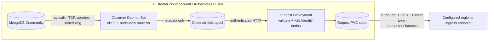

# MongoDB DAM

Standalone customer-cluster components for a MongoDB Database Activity Monitoring product. This repository deploys MongoDB Community, one eBPF Observer per Linux node, and a durable Outpost that sends sanitized metadata to a configured regional endpoint over HTTPS with bearer authentication. The destination is intentionally opaque to this repository and is not assumed to be Collect.

It has no dependency on the Foundry infrastructure repository and contains no GitHub Actions. Building, pushing, and deployment are initiated locally.



## What is implemented

- MongoDB `OP_MSG`, legacy `OP_QUERY`/`OP_REPLY`, and `OP_COMPRESSED` decoding with bounded buffers, fragmentation handling, command/database/collection extraction, response status, and request/response duration correlation.
- Per-connection SCRAM principal attribution plus delete-one/delete-many scope and affected-document metadata for downstream rule evaluation.
- Plaintext socket interception at read/write syscalls and `SSL_read`/`SSL_write` uprobes for compatible OpenSSL/BoringSSL-backed `mongod`/`mongos` processes.
- TCP connect/accept/close, handshake-established events (with duration when the start is observable), peer/active resets, zero-window signals, sampled smoothed RTT, retransmissions, and state-derived timeout signals.
- Plaintext UDP DNS query/response metadata for MongoDB processes, including name, record type, response code, answer count, and correlated duration.
- `pread`, `pwrite`, `fsync`, `fdatasync`, `openat`, slow page-fault, scheduler off-CPU, on-CPU stack, and `pthread_mutex_lock` wait telemetry.
- MongoDB process exec/exit tracking, socket endpoint lookup, pod UID extraction from cgroups, and Outpost enrichment from the Kubernetes API.
- A versioned metadata-only event contract, node-local and Outpost durable spools, assignment validation, internal authentication, regional token authentication, custom CA support, idempotency keys, health endpoints, and Prometheus metrics.
- Optional demo-only Outpost enrichment that maps a salted MongoDB principal to an AWS IAM principal and the exact Secrets Manager credential ARN before HTTP push.
- A generic mock endpoint for integration testing.

The chart pins the official Community image to `mongo:8.0.29-noble`. Override it through `mongodb.image` when your patch-management process approves a newer Community release.

## Privacy boundary

The eBPF program copies at most 1 KiB from a MongoDB I/O operation into a node-local ring buffer so the Observer can identify BSON metadata. Userspace caps each large-frame prefix at 1 KiB even when it arrives through many short syscalls. Those transient bytes are never logged, serialized, spooled, or sent to Outpost. Only the fields defined in `dam-schema` can cross the node boundary; no attempt is made to retain or export the omitted body.

MongoDB authentication principals are never emitted in clear text. Observer extracts a username from an explicit BSON `user` field or the SCRAM client-first payload when present, immediately hashes it with the customer-provided salt, and discards the clear value. In the opt-in IAM demo, Outpost can join that salted hash to a protected customer mapping and export the corresponding IAM ARN, AWS account ID, and Secrets Manager secret ARN as actor metadata. Passwords, AWS credentials, proofs, nonces, and complete authentication payloads are never serialized or exported.

## Prerequisites

- Linux Kubernetes nodes with kernel 5.8 or newer, BTF at `/sys/kernel/btf/vmlinux`, tracefs, and a runtime that permits privileged pods and host PID access.
- For the pinned MongoDB 8 image, avoid Linux kernels 6.19 through 7.0.13. [MongoDB documents that it refuses to start on that range](https://www.mongodb.com/docs/manual/release-notes/8.0/#mongodb-is-incompatible-with-linux-kernel-6.19-through-7.0.13); the deployment preflight detects affected nodes.
- `docker`, `kubectl`, Helm 3/4, and access to a container registry reachable from the customer account.
- A dedicated namespace that may carry the `pod-security.kubernetes.io/enforce=privileged` label.
- Outbound DNS and HTTPS from Outpost to the regional cell. There is no inbound cross-account connection.
- A regional HTTP-push endpoint matching [the contract](docs/HTTP_PUSH_CONTRACT.md). Until the regional receiver is built, Outpost retains batches on its PVC or can target the bundled mock endpoint.

Managed environments that prohibit privileged DaemonSets—such as many serverless Kubernetes node offerings—cannot host Observer. Atlas database nodes are also out of scope because customers cannot attach probes to them.

## Build and push locally

```bash
REGISTRY=111122223333.dkr.ecr.ap-south-1.amazonaws.com \
TAG=v0.1.0 \
PUSH_IMAGES=true \
./scripts/build-images.sh
```

Authenticate Docker to the registry first. For a local cluster, omit `REGISTRY` and `PUSH_IMAGES`, then load the resulting images using the mechanism provided by kind, minikube, or your local runtime.
Set `BUILD_MOCK=true` only when you want the disposable endpoint test image. Set `BUILD_DEMO=true` to build both that receiver and the demo REST API; neither is built or pushed for a normal deployment.

Run the full Rust/eBPF build-time suite and the disposable Outpost contract test locally with:

```bash
make test-container
make test-http-push
make test-secret-access
```

On a Linux Docker host that permits privileged containers, run the live probe-to-MongoDB test with `make test-ebpf`. Override `MONGODB_TEST_IMAGE` when the host kernel is incompatible with the chart's pinned MongoDB 8 image.

## Run the presentation demo

The opt-in demo mode adds a constrained REST application and an in-memory receiver so a presenter can seed dummy commerce data, call `find`/`insert`/`update`/`aggregate`/`delete` operations over HTTP from a client machine, and immediately display the metadata that Observer captured and Outpost delivered.

Build it with `BUILD_DEMO=true`, deploy with `DEMO_MODE=true` and `deploy/examples/demo-values.yaml`, then run `scripts/run-demo.sh`. The exact setup and individual curl commands are in the [three-step demo walkthrough](docs/DEMO.md). MongoDB Community itself does not expose a general-purpose REST query API; the bundled demo API provides that application layer.

## Deploy to the other cloud account

The deployment script refuses to continue unless the active kubecontext exactly matches `EXPECTED_KUBE_CONTEXT`. This is the guardrail against accidentally deploying to the Foundry/current account.

Generate a local ignored secret file once:

```bash
./scripts/generate-secrets.sh
set -a
source deploy/examples/secrets.local.env
set +a
```

Replace the generated `BEARER_TOKEN` with the token provisioned for this source at the regional endpoint, or provision the generated value there. Then deploy:

```bash
export EXPECTED_KUBE_CONTEXT=customer-production
export CUSTOMER_ID=customer-acme
export TENANT_ID=tenant-acme
export SOURCE_ID=mongodb-prod-ap-south-1
export REGIONAL_CELL_ID=cell-ap-south-1
export CLUSTER_NAME=acme-production-eks
export ENDPOINT=https://ingress.cell-ap-south-1.example.com/v1/ingest/mongodb-dam
export OBSERVER_IMAGE_REPOSITORY=111122223333.dkr.ecr.ap-south-1.amazonaws.com/mongodb-dam-observer
export OUTPOST_IMAGE_REPOSITORY=111122223333.dkr.ecr.ap-south-1.amazonaws.com/mongodb-dam-outpost
export TAG=v0.1.0
export VALUES_FILE=deploy/examples/customer-values.yaml
# Set this when overriding mongodb.image.tag so preflight checks that version.
export MONGODB_IMAGE_TAG=8.0.29-noble

./scripts/deploy.sh
./scripts/smoke-test.sh
```

Set `ENDPOINT_CA_FILE=/path/to/ca.pem` when the endpoint uses a private CA. Secrets are staged in a mode-0700 temporary directory, applied as a Kubernetes Secret, and removed when the script exits.

## Repository map

- `bpf/`: CO-RE eBPF programs and the minimal build-time kernel type header.
- `crates/observer/`: probe loader, bounded sanitizer, correlation, enrichment, batching, and node spool.
- `crates/outpost/`: authenticated intake, Kubernetes enrichment, PVC spool, and HTTPS exporter.
- `crates/mongo-protocol/`: safe MongoDB wire/BSON metadata decoder.
- `crates/schema/`: the only serializable data model allowed out of the customer node.
- `crates/mock-endpoint/`: local stand-in for the configured regional endpoint.
- `demo/api/`: disposable HTTP application that creates visible MongoDB activity.
- `deploy/helm/mongodb-dam/`: single Helm chart for the customer cluster.
- `scripts/`: local build, preflight, deployment, and smoke-test entry points.

## Important limits

This implementation reports application request/response duration, available TCP handshake duration, and the kernel's smoothed RTT as separate measurements. A single server-side sensor cannot mathematically split one request delta into exact database execution time and exact network transit time. The lifecycle probes distinguish peer resets, active resets, zero-window signals, retransmissions, and state-derived timeouts; exact packet timestamps and kernel-version-specific reset enums require a separate TC/XDP packet sensor.

TLS visibility depends on compatible, visible `SSL_*` symbols. Observer checks mapped OpenSSL/BoringSSL libraries and exported symbols in a statically linked executable, but inlined/stripped implementations, incompatible custom BIO paths, and kTLS have no generic user-space plaintext boundary to attach to. Compressed MongoDB frames can only be decoded when the complete compressed frame is present in the bounded stream. Plaintext DNS over UDP is decoded; DNS over TCP, DoT, DoH, and batched `sendmmsg`/`recvmmsg` resolver traffic are explicit boundaries.

The profiler emits raw instruction addresses for later symbolization; regional flamegraph aggregation and symbol management belong in the next product phase. The stated overhead must be benchmarked against the customer's kernel, traffic, and profiling settings—it is not safe to promise a universal percentage.

See [known gaps](docs/KNOWN_GAPS.md) and [operations](docs/OPERATIONS.md) before production use.

## Exact three-step DAM demo

The three-step DAM demo is implemented. It uses a small REST service backed by the official [PyMongo driver](https://www.mongodb.com/docs/languages/python/pymongo-driver/current/), plus an in-memory receiver for viewing Outpost deliveries.

I did not deploy it because the active kubecontext is still `rover-dev-auto`, not your separate customer/demo account. Full build and deployment commands are in [DEMO.md](docs/DEMO.md#deploy-demo-mode).

After deploying in demo mode:

### 1. Seed MongoDB

Keep this running:

```bash
kubectl -n mongodb-dam port-forward service/mongodb-dam-demo-api 8080:8080
```

In another terminal:

```bash
curl --fail --silent --request POST \
  http://127.0.0.1:8080/demo/seed | jq .
```

This creates five dummy customers, eight orders, and 35 disposable customer records in `dam_demo`.

### 2. Execute queries from the client machine

Run all five recognizable MongoDB operations:

```bash
curl --fail --silent --request POST \
  http://127.0.0.1:8080/demo/workload | jq .
```

This performs:

```text
find → insert → update → aggregate → delete
```

Individual HTTP examples are in [the walkthrough](docs/DEMO.md#2-execute-queries-over-http-from-the-client-machine).

### 3. See captured DAM activity

Observer performs the capture; Outpost validates, enriches, and delivers it.

The easiest option runs the entire presentation and prints sanitized events plus Observer/Outpost counters:

```bash
export EXPECTED_KUBE_CONTEXT=<customer-demo-context>
# BEARER_TOKEN should already be loaded from secrets.local.env

./scripts/run-demo.sh
```

The output table includes:

```text
OBSERVED_AT  COMMAND  DATABASE  COLLECTION  DURATION_US  SUCCEEDED  SOURCE  POD
```

It should show `find`, `insert`, `update`, `aggregate`, and `delete`, without query filters, emails, order IDs, amounts, or document bodies.

The implementation is in [run-demo.sh](scripts/run-demo.sh), and the demo Kubernetes components are in [demo.yaml](deploy/helm/mongodb-dam/templates/demo.yaml).

Validation passed: 31 Rust tests, strict Clippy, Helm lint/render, demo API integration, mocked Secrets Manager denial verification, Bearer-protected Outpost delivery/quarantine with trusted IAM enrichment, and a privileged live eBPF test covering SCRAM attribution, a captured 35-document bulk delete, IAM enrichment, TCP lifecycle telemetry, and clear-value redaction. The live test uses MongoDB Community 7 on hosts whose kernel cannot run MongoDB 8; the chart remains pinned to Community 8 for supported cluster kernels.

## Exact AWS IAM user → direct MongoDB activity capture demo

This is the end-to-end capture storyline for the MVP. It does not call the demo REST API for the destructive action. A `mongosh` client connects directly to MongoDB, authenticates as a dedicated database user, executes `deleteMany`, and produces an attributed activity event that Observer sends through Outpost. This repository does not decide whether that activity is malicious; Collect and Sentinel will do that after HTTP push is integrated.

### Read this identity boundary first

MongoDB Community does **not** support native `MONGODB-AWS` authentication; [MongoDB documents that mechanism as Atlas-only](https://www.mongodb.com/docs/drivers/rust/current/security/authentication/aws-iam/). Community supports SCRAM authentication, as described in MongoDB's [security checklist](https://www.mongodb.com/docs/manual/administration/security-checklist/). Atlas database nodes cannot run this Observer because customers do not control those hosts. This demo therefore uses the following combination:

```text
AWS IAM user
    └── authorized by AWS to read one Secrets Manager secret
          └── secret maps IAM ARN to one MongoDB SCRAM user
                └── mongosh connects directly to MongoDB
                      └── Observer hashes the SCRAM username and attributes commands
                            └── Outpost joins the protected IAM mapping and HTTP-pushes metadata
```

AWS IAM is the gate for obtaining the database credential; MongoDB Community performs SCRAM-SHA-256 authentication. The clear IAM ARN and Secrets Manager ARN are stored in a protected, demo-only Kubernetes Secret mounted only into Outpost. Outpost performs the trusted join and exports those identifiers as metadata. Passwords, AWS credentials, delete filters, and document bodies are not exported.

In the MongoDB wire command, [`limit: 0` identifies a multi-delete and response field `n` reports the deleted count](https://www.mongodb.com/docs/manual/reference/command/delete/). Observer correlates those request and response facts on the authenticated connection, then Outpost validates, enriches, and delivers the event. Neither component assigns a severity, emits a finding, evaluates a rule, or blocks a user. Those responsibilities belong to Sentinel downstream of Collect.

### What this flow demonstrates

- AWS authorizes a named IAM principal to retrieve exactly one demo database credential.
- That identity uses `mongosh` directly; the destructive query does not pass through the REST API.
- Observer correlates the SCRAM exchange to the same physical MongoDB connection.
- The exported `mongodb_activity` contains the IAM user ARN, AWS account ID, credential-secret ARN, salted MongoDB principal hash, `delete_scope=multi`, and `affected_documents=35`.
- Outpost receives that activity, replaces any untrusted incoming identity with its protected mapping, adds available Kubernetes metadata, and delivers it to the exact configured HTTP endpoint.
- A later Collect/Sentinel pipeline can match rules against the activity without putting detection logic in the customer cluster.

### Prerequisites for this flow

Use the separate customer/demo AWS account and cluster, not the Foundry/current account. You need:

- the demo deployment from this repository, with its in-memory receiver enabled;
- an AWS administrator profile that can manage one Secrets Manager secret;
- an existing same-account IAM user for the simulated database user;
- a second AWS CLI profile that actually assumes/uses that IAM identity;
- `aws`, `docker`, `kubectl`, `jq`, `openssl`, `sha256sum`, and `base64` on a Linux client;
- the local secret environment produced by `scripts/generate-secrets.sh`.

The direct-client scripts use Docker host networking. Run them on Linux. AWS documents how a [resource-based policy can grant a principal access to one secret](https://docs.aws.amazon.com/secretsmanager/latest/userguide/auth-and-access_resource-policies.html) and that [an explicit deny overrides an allow](https://docs.aws.amazon.com/secretsmanager/latest/userguide/determine-acccess_examine-iam-policies.html). Therefore, if an Organizations SCP, permissions boundary, or another policy explicitly denies `secretsmanager:GetSecretValue`, the resource policy created by the provisioner cannot override it.

### Step 0 — build and deploy demo mode in the other account

Skip this step only if the current demo images, including the direct-user capture changes, are already deployed.

From the repository root in the administrator terminal:

```bash
export REGISTRY=111122223333.dkr.ecr.ap-south-1.amazonaws.com
export TAG=v0.1.0-dam-demo

BUILD_DEMO=true PUSH_IMAGES=true ./scripts/build-images.sh

# Run this only once. It refuses to overwrite an existing local secret file.
./scripts/generate-secrets.sh
set -a
source deploy/examples/secrets.local.env
set +a

export EXPECTED_KUBE_CONTEXT=<other-account-customer-demo-context>
export CUSTOMER_ID=customer-demo
export TENANT_ID=tenant-demo
export SOURCE_ID=mongodb-demo
export REGIONAL_CELL_ID=cell-demo
export CLUSTER_NAME=customer-demo-cluster
export DEMO_MODE=true
export ENDPOINT=http://mock-endpoint:8088/v1/ingest/mongodb-dam
export VALUES_FILE=deploy/examples/demo-values.yaml
export OBSERVER_IMAGE_REPOSITORY="$REGISTRY/mongodb-dam-observer"
export OUTPOST_IMAGE_REPOSITORY="$REGISTRY/mongodb-dam-outpost"
export DEMO_API_IMAGE_REPOSITORY="$REGISTRY/mongodb-dam-demo-api"
export DEMO_RECEIVER_IMAGE_REPOSITORY="$REGISTRY/mongodb-dam-mock-endpoint"

./scripts/deploy.sh
./scripts/smoke-test.sh
```

The deployment refuses to proceed unless the active context exactly equals `EXPECTED_KUBE_CONTEXT`.

Confirm the rollout:

```bash
kubectl -n mongodb-dam get pods -o wide
```

MongoDB, Outpost, the demo API, and the demo receiver should be ready, and there should be one ready Observer on the MongoDB node.

### Step 1 — seed the 35 disposable records

In administrator terminal 1, keep the API forward running:

```bash
export EXPECTED_KUBE_CONTEXT=<other-account-customer-demo-context>
kubectl -n mongodb-dam port-forward service/mongodb-dam-demo-api 8080:8080
```

In administrator terminal 2:

```bash
curl --fail --silent --show-error \
  --request POST http://127.0.0.1:8080/demo/seed | jq .
```

Expected result:

```json
{
  "status": "seeded",
  "database": "dam_demo",
  "customers": 5,
  "orders": 8,
  "customer_records": 35
}
```

The destructive-user scenario targets only `dam_demo.customer_records` documents tagged for this demo.

### Step 2 — choose the IAM identity and provision its direct database user

In administrator terminal 2, select your administrator AWS profile and the existing IAM user that will act as the database user:

```bash
export AWS_PROFILE=dam-admin
export AWS_REGION=ap-south-1
export AWS_ACCOUNT_ID="$(aws sts get-caller-identity --query Account --output text)"
export EXPECTED_KUBE_CONTEXT=<other-account-customer-demo-context>
export DEMO_AWS_SECRET_ID=mongodb-dam/demo/direct-user

export DEMO_IAM_PRINCIPAL_ARN="arn:aws:iam::$AWS_ACCOUNT_ID:user/dam-demo-alice"

./scripts/provision-direct-user.sh
```

The provisioner:

1. verifies the Kubernetes context and AWS account;
2. derives a stable MongoDB username from the IAM ARN;
3. creates or rotates that SCRAM user with only `readWrite@dam_demo`;
4. writes the generated password to AWS Secrets Manager without printing it;
5. puts a Secrets Manager resource policy granting only the chosen IAM principal `GetSecretValue`;
6. stores the IAM ARN, AWS account, secret ARN, and salted MongoDB-principal-hash mapping in the demo namespace;
7. restarts Outpost so its next accepted batch is deterministically enriched with that mapping.

Expected summary resembles:

```text
Direct-user mapping provisioned.
IAM principal:       arn:aws:iam::111122223333:user/dam-demo-alice
MongoDB user:        iam-0123456789abcdef (SCRAM, readWrite on dam_demo)
DAM principal hash:  sha256:<64 hexadecimal characters>
AWS secret ARN:      arn:aws:secretsmanager:ap-south-1:111122223333:secret:...
The password was written only to AWS Secrets Manager and was not printed.
```

Verify that the second CLI profile really represents the selected IAM user:

```bash
AWS_PROFILE=dam-user aws sts get-caller-identity
```

Do not continue unless this is the intended demo user. If `GetSecretValue` is denied despite the secret resource policy, check that identity's permissions boundary and your Organizations SCPs for an explicit deny.

### Step 3 — open the direct MongoDB tunnel as the presenter

Keep this running in administrator terminal 3:

```bash
export EXPECTED_KUBE_CONTEXT=<other-account-customer-demo-context>
kubectl -n mongodb-dam port-forward service/mongodb-dam-mongodb 27018:27017
```

This keeps MongoDB private; it does not expose a public LoadBalancer. The next command is still a direct MongoDB wire-protocol connection from `mongosh`, not an API call.

### Step 4 — run the bulk delete as the IAM-mapped user

Open the simulated user's terminal. Select the user profile, verify it, and run:

```bash
export AWS_PROFILE=dam-user
export AWS_REGION=ap-south-1
export AWS_ACCOUNT_ID="$(aws sts get-caller-identity --query Account --output text)"
export DEMO_IAM_PRINCIPAL_ARN="arn:aws:iam::$AWS_ACCOUNT_ID:user/dam-demo-alice"
export EXPECTED_KUBE_CONTEXT=<other-account-customer-demo-context>
export DEMO_AWS_SECRET_ID=mongodb-dam/demo/direct-user
export USE_EXISTING_MONGODB_FORWARD=true
export MONGODB_LOCAL_PORT=27018

aws sts get-caller-identity
./scripts/direct-user-bulk-delete.sh
```

The script first asks AWS Secrets Manager for the mapped credential as the current IAM identity. It refuses to continue if the caller and stored identity do not match. It then runs this direct MongoDB operation from a disposable `mongosh` container:

```javascript
db.getSiblingDB("dam_demo")
  .customer_records
  .deleteMany({demo_batch: "iam-bulk-delete"})
```

Expected result:

```json
{
  "command": "deleteMany",
  "database": "dam_demo",
  "collection": "customer_records",
  "matchingBeforeDelete": 35,
  "deletedCount": 35
}
```

The password exists transiently in the disposable container environment and is removed with that container. This handling is suitable for demoware, not production credential delivery.

The script also writes a non-secret start-time marker to `/tmp/mongodb-dam-direct-user-last-run-$UID`. The viewer uses it to avoid displaying stale activity from an earlier presentation. If the user and presenter terminals are on different machines, copy the printed epoch value and set `DIRECT_USER_NOT_BEFORE_EPOCH=<value>` before step 5.

### Step 5 — display the attributed activity delivered by Outpost

Back in administrator terminal 2, keep `BEARER_TOKEN` loaded from `deploy/examples/secrets.local.env`, then run:

```bash
export EXPECTED_KUBE_CONTEXT=<other-account-customer-demo-context>
set -a
source deploy/examples/secrets.local.env
set +a

./scripts/show-direct-user-activity.sh
```

The command waits for Observer → Outpost → configured demo receiver delivery and prints the newest matching `mongodb_activity`. Expected shape:

```json
{
  "observed_at": "2026-09-09T12:00:00Z",
  "iam_principal_arn": "arn:aws:iam::111122223333:user/dam-demo-alice",
  "aws_account_id": "111122223333",
  "credential_source": "aws_secrets_manager",
  "credential_secret_arn": "arn:aws:secretsmanager:ap-south-1:111122223333:secret:...",
  "mongodb_principal_hash": "sha256:...",
  "command": "delete",
  "database": "dam_demo",
  "collection": "customer_records",
  "delete_scope": "multi",
  "delete_statements": 1,
  "affected_documents": 35,
  "succeeded": true,
  "error_code": null,
  "error_name": null,
  "duration_us": 1234,
  "request_bytes": 156,
  "response_bytes": 45,
  "connection_id": "1234:17",
  "remote": {"address": "10.0.1.25", "port": 41862},
  "capture_source": "cleartext_syscall",
  "pod": "mongodb-dam-mongodb-0",
  "node": "ip-10-0-1-10"
}
```

This output is the proof: the command came from the direct MongoDB user, Observer attributed it to the salted SCRAM principal, Outpost joined the protected IAM mapping and delivered it, and no query predicate or document body crossed the boundary. The IAM and secret ARNs shown here are inside the exported event so Collect can persist the actor and Rover can display and target the correct demo identity.

The bundled receiver stands in for the configured regional ingress during this demo. Once the regional path exists, the same event flows through Collect and Sentinel can match a rule such as “successful multi-delete affecting at least 10 documents.” No rule, severity, finding, or blocking action is produced in this customer-side repository.

### Step 6 — Rover revokes future credential retrieval

This action belongs in Rover, not this repository. The intended demo request is:

```text
Rover UI
  -> Rover backend using temporary customer global-admin AWS credentials
  -> iam:PutUserPolicy on dam-demo-alice
  -> explicit Deny secretsmanager:GetSecretValue on the one exported secret ARN
```

There is deliberately no customer-side revoke HTTP endpoint and no IAM policy mutation script in `mongodb-dam`. Once the Rover action reports success, continue in the simulated user's terminal.

### Step 7 — verify the IAM user was denied

Keep the user-profile exports from step 4 and run:

```bash
./scripts/verify-direct-user-secret-revoked.sh
```

Expected result:

```json
{
  "status": "verified",
  "iam_principal_arn": "arn:aws:iam::111122223333:user/dam-demo-alice",
  "aws_secret_id": "mongodb-dam/demo/direct-user",
  "secret_access": "denied"
}
```

The verifier requests only the secret ARN from AWS CLI output, never the secret value. It succeeds only for the expected IAM caller and an `AccessDenied` result; a reachable secret or unrelated AWS failure makes the verification fail. Running `direct-user-bulk-delete.sh` again now also stops at `GetSecretValue` before opening a new MongoDB connection.

This proves that Rover blocked new retrieval through the managed demo path. IAM cannot erase a password that was already copied or terminate an already-open MongoDB session. The demo intentionally uses a fresh Secrets Manager lookup and a disposable `mongosh` container for every operation.

### Step 8 — reset and repeat the presentation

First use Rover to remove its demo inline deny policy. Then, in the administrator terminal, run the provisioner again to rotate the MongoDB password, refresh the secret and mapping, and restart Outpost:

```bash
export AWS_PROFILE=dam-admin
./scripts/provision-direct-user.sh
```

Run the seed call again to recreate all 35 disposable records:

```bash
curl --fail --silent --show-error \
  --request POST http://127.0.0.1:8080/demo/seed | jq .
```

Repeat steps 4 through 7. Resetting Rover's deny is intentionally not automated here because AWS response ownership belongs to Rover.

### DAM dashboard views supported by this telemetry

After Collect persists the activity and Sentinel evaluates rules, the regional UI can build these MVP panels:

- a live database activity stream by customer, cluster, database, collection, command, success, pod, and node;
- a direct database-user timeline keyed by the exported IAM ARN and salted MongoDB principal;
- delete activity cards showing single/multi scope, statement count, affected count, duration, connection, pod, and node;
- top active principals, databases, collections, and commands over time;
- command volume, error rate, latency percentiles, and slow-operation views by command/database/collection;
- authentication success/failure and user-management command timelines;
- connection churn, resets, retransmits, smoothed RTT, zero-window, and timeout views;
- host I/O latency, page-fault, off-CPU, on-CPU, and lock-wait correlations;
- Sentinel findings and cases joined back to the exact immutable source activity that caused each rule match.

The bundled receiver is only an event viewer; it is not yet that dashboard. Durable regional storage, identity governance, Sentinel rules, alert state, case management, and the Collect HTTP-push path are the next-cell work.

### Known MVP gaps in this exact storyline

- This is AWS-IAM-gated credential retrieval plus MongoDB SCRAM, not native MongoDB IAM authentication.
- Observer and Outpost intentionally perform capture and transport only. Detection and response wait for Collect/Sentinel integration.
- The opt-in demo exports clear IAM and Secrets Manager ARNs. A production design needs a secure identity registry, explicit data-governance approval, and an audited mapping lifecycle.
- The provisioner supports a same-account IAM principal. Cross-account Secrets Manager access needs a customer-managed KMS key and additional key/resource policies.
- `mongosh` runs in a short-lived Docker container and uses a presenter-owned Kubernetes port-forward. This avoids exposing MongoDB publicly but is not a production access architecture.
- Attribution is connection-scoped. A capture gap during SCRAM, unsupported TLS library, undecodable compression, or command metadata beyond the bounded prefix can produce activity without a principal.
- An asynchronous eBPF sensor observes completed operations; inline prevention would require a separate synchronous enforcement point.
- IAM denial blocks future Secrets Manager retrieval, not a previously copied password or already-open MongoDB session. The disposable demo client makes a new secret request for each operation.
